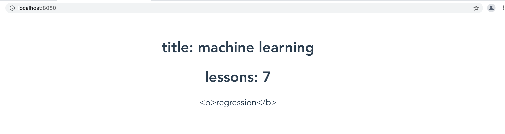
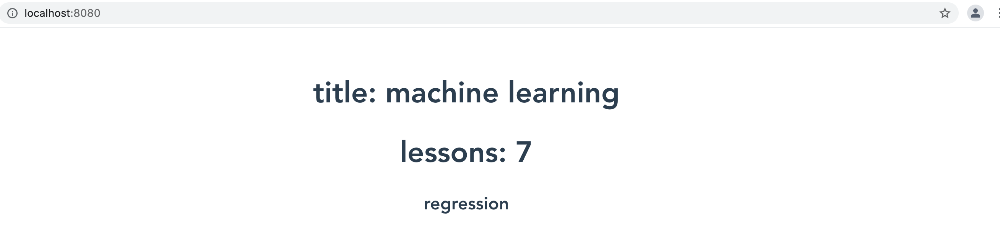
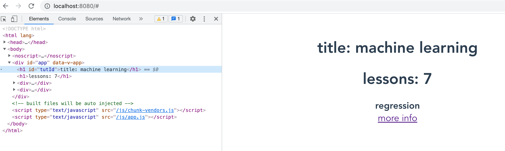

### MVVM

其中 `HelloWorld.vue` 文件为一个单文件组件(SFC)，


## 数据绑定

第一次接触到数据绑定概念，还是在 Angularjs 1.x 时候，Angularjs 1.x 出现让我们习惯了 JQuery 的前端开发者耳目一新，可以说一次飞跃，随着大家就开始谈了 MVVM 这种设计模式，其实这种设计模式并没有什么新意，多年前微软就在桌面应用开发中就提出了这种设计模式，只不过这一会有人将他引入到 web 开发中，有时候说明多学一些没有什么坏处，突破局限不仅要靠内力，有时候也需要跨界的灵感。


| 指令名称 | 指令说明                                                     |      |
| -------- | ------------------------------------------------------------ | ---- |
| v-text   | 将文本绑定到 html 元素上，这个应该是一个单向绑定             |      |
| v-html   | 将 html 结构文本绑定 HTML 元素上                             |      |
| v-bind   | 将变量绑定到 HTML 属性上，例如 `v-bind:class` 或者 `v-bind:style` |      |
|          |                                                              |      |


### 绑定文本

今天介绍如何将 script 代码块中数据绑定到到 template 的 UI 上，我们把 hello-world 项目中 components 中 HelloWorld 组件去掉，让项目变得比较干净这样一来便于关注要学习内容。

```vue
<template>
<h1>Hello Vue</h1>
</template>

<script>
export default {
  name: 'App',
}
</script>

<style>
#app {
  font-family: Avenir, Helvetica, Arial, sans-serif;
  -webkit-font-smoothing: antialiased;
  -moz-osx-font-smoothing: grayscale;
  text-align: center;
  color: #2c3e50;
  margin-top: 60px;
}
</style>

```

在 Vue 数据绑定遵循 mustache 语法，大家可以了解一个 mustache 一些，对于一些小的项目或者比较鼓励项目可以引入 mustache 来实现数据绑定，早在之前自己就用用 mustache 实现过数据绑定。在大括号之间仅支持表达式，并不支持声明语句，有关数据复杂操作交个 vue 来处理。

```vue
<template>
<h1>{{title}}</h1>
</template>

<script>
export default {
  name: 'App',
  data(){
    return {
      title:"machine learning"
    }
  }
}
</script>

<style>
#app {
  font-family: Avenir, Helvetica, Arial, sans-serif;
  -webkit-font-smoothing: antialiased;
  -moz-osx-font-smoothing: grayscale;
  text-align: center;
  color: #2c3e50;
  margin-top: 60px;
}
</style>

```


在花括号也支持一些运算操作，

```vue
<template>
<h1>title: {{title}}</h1>
<h1>lessons: {{ 2 + 5 }}</h1>
</template>
```


### 指令集方式来绑定文本

在 Vue 提供另一种方式，用指令集方式来将文本绑定到页面上 DOM 元素，在 Vue 中指令集都是 v 加连接符方式的指令集。

```vue
<template>
<h1>title: {{title}}</h1>
<h1>lessons: {{ 2 + 5 }}</h1>
<h1 v-text="subTitle"></h1>
</template>
```


```vue
<template>
<h1>title: {{title}}</h1>
<h1>lessons: {{ 2 + 5 }}</h1>
<h1 v-text="subTitle">hello</h1>
</template>
```

```js
VueCompilerError: v-text will override element children.
at /Users/zidea2020/Desktop/myrepo/vue_tut/hello-world/src/App.vue:4:5
2  |  <h1>title: {{title}}</h1>
3  |  <h1>lessons: {{ 2 + 5 }}</h1>
4  |  <h1 v-text="subTitle">hello</h1>
   |      ^^^^^^^^^^^^^^^^^
5  |  </template>
6  |  
```


### 绑定 HTML

如果我们想要将 html 绑定到界面上，如果还有

```vue
<script>
export default {
  name: 'App',
  data(){
    return {
      title:"machine learning",
      subTitle:"<b>regression</b>"
    }
  }
}
</script>
```


```vue
<template>
<h1>title: {{title}}</h1>
<h1>lessons: {{ 2 + 5 }}</h1>
<div v-text="subTitle"></div>
</template>
```





```vue
<template>
<h1>title: {{title}}</h1>
<h1>lessons: {{ 2 + 5 }}</h1>
<div v-html="subTitle"></div>
</template>
```





```vue
<template>
<h1>title: {{title}}</h1>
<h1>lessons: {{ 2 + 5 }}</h1>
<div v-html="subTitle"></div>
<div v-html="moreInfo"></div>
</template>

<script>
export default {
  name: 'App',
  data(){
    return {
      title:"machine learning",
      subTitle:"<b>regression</b>",
      moreInfo: `<a href="#" onclick="alert('machine learning regression')" >more info</a>`
    }
  }
}
</script>
```


### 绑定属性(v-bind)

`v-bind`将 HTML 某一个属性进行绑定，随后跟踪冒号表示要传入一个 Html 属性作为 `v-bind` 的一个参数，这里点和 `v-on` 有些

```vue
<template>
<h1 v-bind:id="tutId">title: {{title}}</h1>
<h1>lessons: {{ 2 + 5 }}</h1>
<div v-html="subTitle"></div>
<div v-html="moreInfo"></div>

</template>

<script>
export default {
  name: 'App',
  data(){
    return {
      tutId:'tutId',
      title:"machine learning",
      subTitle:"<b>regression</b>",
      moreInfo: `<a href="#" onclick="alert('machine learning regression')" >more info</a>`
    }
  }
}
</script>
```





### 绑定样式(class)

```vue
<div v-bind:class="status">Log Level</div>
```

可以通过 `v-bind:class` 或者简写为`:class` 来绑定样式，根据属性变量为 `status`，应用场景为例如通过不同颜色来表示表单验证结果是否通过。而且 `v-bind:class` 是在原有 `class` 基础上追加样式表。在 `v-biind:class` 可以可以接受表达式

```vue
<h2 v-bind:class="isPromoted && 'promoted'">Promoted Movie</h2>
```

通过一个变量可以控制是否添加 `promoted`样式到 DOM 元素上，也可以接受一个数组来将多个样式应用到一个元素 `:class="['oneClass','twoClass']"`,而且每一个元素也可以接受一个 js 表达式 `class="[isSuccess ? 'success':'danger',isPromoted && 'promoted']"` 。


```vue
<style>
.success{
  color:greenyellow;
  font-weight: bolder;
}
.info {
  color: orangered;
  font-weight: bolder;
}
</style>
```


```vue
<template>
<h1 v-bind:id="tutId">title: {{title}}</h1>
<h1>lessons: {{ 2 + 5 }}</h1>
<div v-html="subTitle"></div>
<div v-html="moreInfo"></div>
<button v-bind:disabled="isDisable">btn</button>
<div v-bind:class="status">Log Level</div>
<h1 v-bind:class="isSuccess ? 'success':'danger'" >{{isSuccess ? 'success':'danger'}}</h1>
</template>

<script>
export default {
  name: 'App',
  data(){
    return {
      tutId:'tutId',
      title:"machine learning",
      subTitle:"<b>regression</b>",
      moreInfo: `<a href="#" onclick="alert('machine learning regression')" >more info</a>`,
      isDisable:false,
      status:"success",
      isSuccess:true
    }
  }
}
</script>
```


```vue
<template>
<h1 v-bind:id="tutId">title: {{title}}</h1>
<div v-html="subTitle" v-bind:class="big-size"></div>
<div v-html="moreInfo"></div>
<h1 v-bind:class="['big-size',isCompleted ? 'completed':'danger']" >完成</h1>
<h1 v-bind:class="{
  'txt_decoration':isCompleted,
  'big-size':isCompleted,
  'danger':isCompleted
  }">状态{{isCompleted?"完成":"未完成"}}</h1>
</template>

<script>
export default {
  name: 'App',
  data(){
    return {
      tutId:'tutId',
      title:"Machine Learning",
      subTitle:"<b>regression</b>",
      moreInfo: `<a href="#" onclick="alert('machine learning regression')" >更多信息</a>`,
      isCompleted:false
    }
  }
}
</script>

<style>
.txt_decoration{
  text-decoration: underline;
}
.danger{
  color: orangered;
}
.completed{
  color: cornflowerblue;
}
.big-size{
  font-size: 1.25em;
}
#app {
  font-family: Avenir, Helvetica, Arial, sans-serif;
  -webkit-font-smoothing: antialiased;
  -moz-osx-font-smoothing: grayscale;
  text-align: center;
  color: #2c3e50;
  margin-top: 60px;
}
div{
  font-size: 1.2em;
}
</style>

```


## 条件渲染(Conditional Rendering)

很多情况下，我们都需要根据数据来控制显示/或者不显示某些元素


| 名称        | 说明             | 备注         |
| ----------- | ---------------- | ------------ |
| v-if/v-else | 是否显示当前元素 | 可以用于模板 |
|             |                  |              |

```vue
<template>
    <div>
        <span v-if="count === 0">Like</span>
        <span v-else>Like:{{count}}</span>
    </div>
</template>
<script>

export default{
    name:'Like',
    data(){
        
        return{
            count:5
        } 
    }
}
</script>
```


> v-if 是动态添加，当值为false 时，是完全移除该元素，即dom 树中不存在该元素。 v-show 仅是隐藏/ 显示，值为false 时，该元素依旧存在于dom 树中。 等同给元素设置了`display: none` 而隐藏元素显示。


### 渲染列表

绑定列表

```vue
<template>
    <div>
        <tut-card/>
    </div>
    <div v-for="title in titles" :key="title">
        <div>{{title}}</div>
    </div>
    <template v-for="title in titles" :key="title">
        <h5>{{title}}</h5>
    </template>
    <div style="margin-bottom:20px;">
    </div>
    <div v-for="(title,index) in titles" :key="title">
        {{index}} {{title}}
    </div>
    <div style="margin-bottom:20px;">
    </div>
    <div v-for="(tut,index) in tuts" :key="tut.title">
        {{index}} {{tut.title}}({{tut.category}})
    </div>
    <div v-for="category in cate" :key="category.category">
        <div>{{category.category}}</div>
        <h5 v-for="tut in category.tuts" :key="tut.title">{{tut.title}}</h5>
    </div>
    <div>

    </div>
</template>
<script>
import TutCard from './TutCard.vue'
export default{
    name:'Tuts',
    components:{
        TutCard
    },
    data(){
        return{
            titles:[
                'TypeScript 深入浅出—interface 和 type',
                'TypeScript 深入浅出—为什么我们需要 TypeScript',
                '程序员绕不开的算法8 —基数排序算法'
            ],
            tuts :[
                {title:"TypeScript 深入浅出—interface 和 type",category:"web"},
                {title:"TypeScript 深入浅出—为什么我们需要 TypeScript",category:"web"},
                {title:"程序员绕不开的算法8 —基数排序算法",category:"算法"}
            ],
            cate: [
                {
                    category:"machine leanring",
                    tuts:[
                        {title:"寻找网络最大流算法(1)—Ford-Fulkerson 算法"},
                        {title:"深度学习框架新贵—JAX(2)—JAX 能否终结 Numpy 的时代"}
                    ]
                },
                {
                    category:"web develop",
                    tuts:[
                        {title:"只用 JS 自己动手实现一个 Web Component"},
                        {title:"用于 Javascript 去解析 Javascript 自己动手写一个 Parser(1)"}
                    ]
                }
            ]

        }
    }
}
</script>

```


| 名称 |      |      |
| ---- | ---- | ---- |
| v-on |      |      |
|      |      |      |