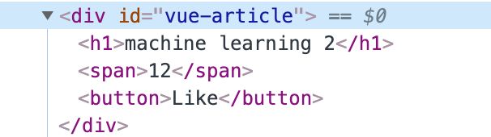
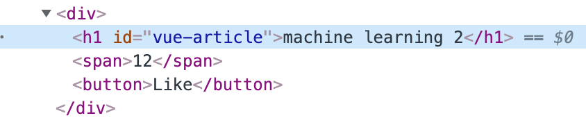
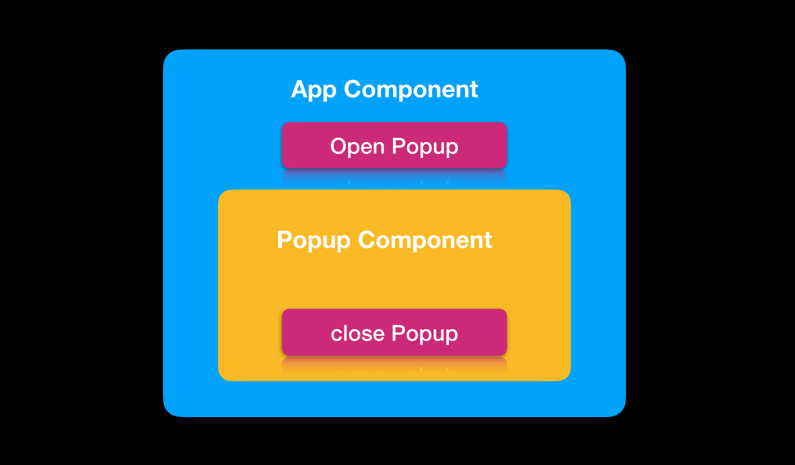
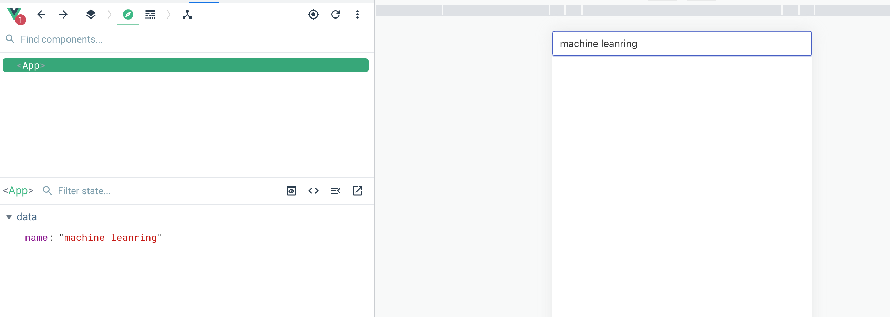
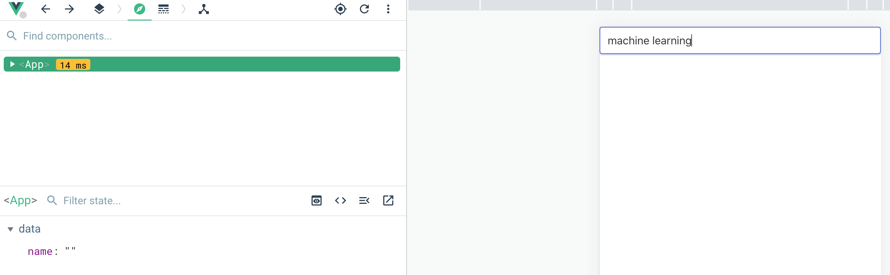

## Vue 组件(Component in Vue)

组件化是当下流行框架、例如 Angular、React 或者 Vue 的显著的特点，将界面划分为一个一个组件，这些组件是一个封闭的部件。每一个组件通常是一个小型。通过组件我们将应用页面分割一小块一小块，那么这些小块是关系层层嵌套，形成一个树形的结构，我们看一看这些组件(结点)时候如何传递数据的。

#### 带着问题学习

- 如何创建一个组件
- 如何使用一个组件
- 组件间如何传递信息(至上而下传递数据、从下至上传递数据、跨组件传递数据)
- 组件的声明周期

### 先聊一聊 .Vue 文件，

- vue 文件是一种自定义文件格式，使用类似 HTML 的语法来描述UI的一部分。
- 每个vue文件由三种类型的顶级语言块组成

```vue
<template></template>
<script></script>
<style></style>
```

- 其中` template` 代码块类似 HTML 来定义组件的 UI
- `script `代码块中用于存放应用的逻辑和功能
- `style` 代码块中用于维护修饰 `template` 结构的样式

浏览器并不认识 vue 文件，在构建项目时，webpack 会用 vue 加载器对 vue 文件进行处理编译为浏览器可以识别的文件。

### 组件创建

```vue
export default {
  name:"CompA",
  components:{
  	CompB
  }
}
```

组件通过暴露给使用者来调用，每个组件通过暴露`export` 对象供其他组件使用，下面当组件 `CompA` 调用组件 `CompB` 时候还需要对齐进行注册，如下在 `components`

```vue
<script>
    import CompB from "./CompB.vue"
    export default {
        name:"CompA",
        components:{
            CompB
        }
    }
</script>
```

这里我们简单输出一下导入的 `CompB`组件，其中有一个 name 属性还有 render 方法等

```
console.log(CompB)
```


### 组件分类

- 组件作为容器
- 
### 组件间传递数据

有的时候，为了让组件不失灵活性，将组件的可变性交给使用者，使用者通过在调用组件时传入参数来控制组件。可以简单将组件理解为一个参数，例如通常组件是对数据可视化的一个载体，那么具体要显示什么样数据，还需要组件调用者在调用时决定。

### props

#### 静态 prop
可以通过为组件定义属性来实现，通过属性向组件内部穿值
```vue
<TutCard  title="machine learning"/>
```
在调用组件时可以定义属性然后传入


```vue
props:['title']
```
```vue
<template>
    <div>
        <div class="card">
        <div class="card-header">
            <div class="card-header-title">{{title}}</div>
        </div>
        </div>
    </div>
</template>
```
这样一来组件外通过调用

#### props 类型
现在可以指定参数来向 component 内部传递数据从而达到组件多态。指定好参数，我们希望对参数的类型给予一定限制，限制传递参数的类型。
```vue
title:{
  type:String,
  required:true,
  default:"machine learning"
},
```
- type: 指定 prop 的类型，例如 String、Number 或者 Boolean 注意这里都是大写
- required: 接受一个 bool 类型值，表示该参数是否为必填的参数
- default: 给定参数一个默认值


#### 动态 prop
通过将 prop 属性绑定到属性变量，从而可以动态对 prop 进行赋值
```vue
<tut-card title="machine learning" :content="tutContent"/>
```
#### non-props 属性
non-prop 属性是一个传递给组件的属性，但在组件的 prop 选项中并没有对其进行定义的属性，例如 id、class 或者 style 这样属性

```
<Article id="vue-article" title="machine learning 2" :likes=12 />
```
上面在 Article 组件处理 id 属性，其他属性都是自定义属性，我们可以通过自定义属性向组件进行传值。



```vue
<template>
    <div>
        <h1>{{title}}</h1>
        <span>{{likes}}</span>
        <button @click="clickOnLike">Like</button>
    </div>
</template>
```

当我们给组件添加了 non-prop id 属性，因为这个根节点的 `<div>` 的元素，所以 id 会自动分配给根节点。如果向下下面这样去掉根节点，这 vue 不会把组件 id 属性分配任意元素。

```vue
<template>
    <h1>{{title}}</h1>
    <span>{{likes}}</span>
    <button @click="clickOnLike">Like</button>
</template>
```


如果想要实现将 non-prop 分配给某一个特定组件中的元素，而不是外层 `div` 元素，可以通过两个步骤实现，首选对要指定将 id 的 non-prop 分配其元素进行如下改造

```vue
<h1 v-bind="$attrs">{{title}}</h1>
```

添加`v-bind:"$attrs"` 给 `h1`元素，然后在对象中添加如下属性


```vue
inheritAttrs:false
```




### 自定义事件

从下至上传递数据，之前介绍通过 prop 从上至下传递数据，那么如何从下至上进行传递数据，Vue 给出答案和其他框架类似都是通过事件来传递数据。



这里通过弹出框实例来解释如何从下至上传递信息的，App Component 设置一个按钮 Open Popup 按钮用于控制是否显示组件，对于组件 PopupComp 的控制是用 `v-show` 来控制，当将 `v-show` 设置为 `false` ，当 `v-show` 设置为 `true` 则显示。在嵌套组件通过发射事件给其外层组件来通知组件从而达到信息传递的效果。

```vue
emits: ['close']
```

来定义事件，这里事件名称是可以随意起一个名字，这里定义为 `close` 更加贴切，定义好事件，就可以通过按钮来发射事件了

```vue
<button  class="button" @click="$emit">Close Popup</button>
```

在 Popup 内部组件按钮将发射事件的工作交个 `click` 动作，接下来我们看在 App 组件中如何接受这个自定义事件。如下

```vue
<Popup v-show="showPopup" @close="showPopup = false" />
```

在定义组件中添加 `@close` 也就是就是 `@` 符号后面跟上事件名称`close` ，然后再`@close="事件逻辑"`从而完成一个对话框弹出效果，通常我们还需要在对话框进行操作，然后关闭对话框时向外层组件传递一些数据。可以进行如下修改

```vue
<button  class="button" @click="$emit('close',title)">Close Popup</button>
```

在 `$emit ` 后面定义 `close`名称，第二个参数添加 title 参数，然后再外层组件可以接受参数


```vue
<Popup v-show="showPopup" @close="closePopup" />
```

现在在 `Popup` 中的 `@close` 调用一个函数 `closePopup` 


```vue
methods:{
    closePopup(name){
      this.showPopup = false
      console.log(name)
    }
  }
```


#### PopUpVue

```vue
<template>
    <div>
        <div >
            <h1>this is popup </h1>
            <input type="text" v-model="title"/>
        </div>
        <button>Close Popup</button>
    </div>
</template>
```

定义

#### AppVue

```vue
<Popup v-show="showPopup" />
```

在 App 中引入组件通过 `v-show` 属性控制其显示


要隐藏 PopUp 我们需要在组件外面通过 AppVue 


### V-model 在 Component


```vue
<template>
<div class="container">
<form class="form">
<fieldset class="fieldset">
<div class="control">
<input class="input" type="text" v-model="name"/>
</div>
</fieldset>
</form>
</div>
</template>

<script>


export default {
  name: 'App',
  data(){
    return {
      name:""
    }
  },
  components: {
    
  }
}
</script>
```





```vue
<template>
    <input type="text"/>
</template>

<script>
    export default {
        name:"Input"
    }
</script>
```


```vue

<template>
<div class="container">
<form class="form">
<fieldset class="fieldset">
<div class="control">
<Input class="input" type="text" v-model="name"/>
</div>
</fieldset>
</form>
</div>
</template>

<script>
import Input from "./components/Form/Input.vue"

export default {
  name: 'App',
  data(){
    return {
      name:""
    }
  },
  components: {
    Input
  }
}
</script>

```





```vue
<template>
    <input type="text" :value="modelValue" @input="$emit('update:modelValue',$event.target.value)"/>
</template>

<script>
    export default {
        name:"Input",
        props: {
            modelValue:String
        }
    }
</script>
```

因为使用了 `v-model` 指令，所以会接受到一个一个名称为 `modelvalue` 的 prop ，然后将 `modelValue`绑定到 value 值，当`v-model` 作用在自定义组件上，就可以通过`update:modevalue` 事件来更新 `v-model`的值。


### Provide/Inject

避免一层一层传递 prop 属性。

- Provide the value in the App component
- Inject the value in the component F
- 


### 动态组件（Dynamic Components)


