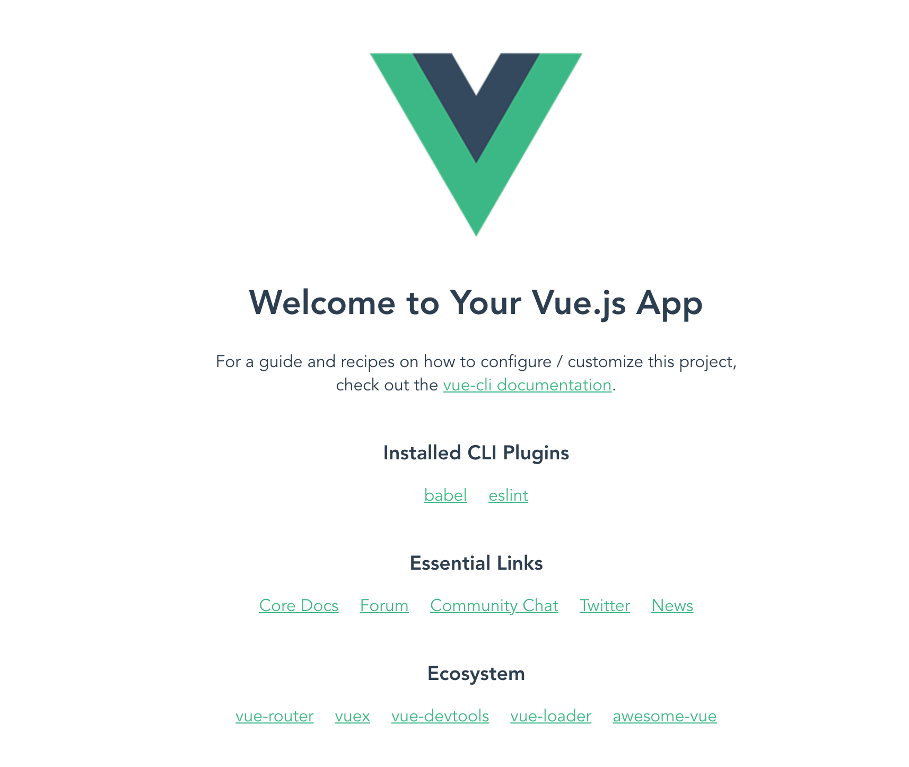
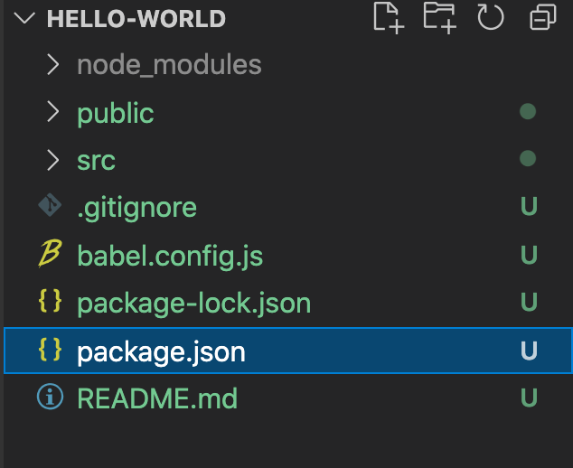
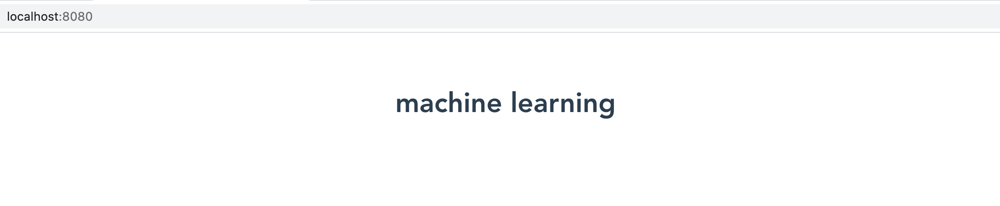
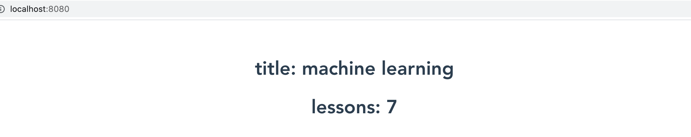
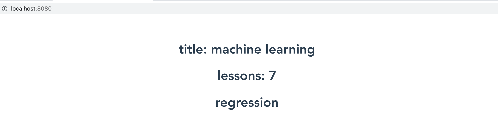
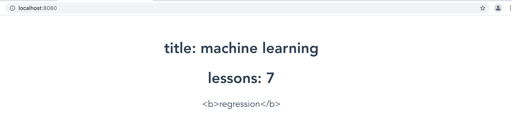
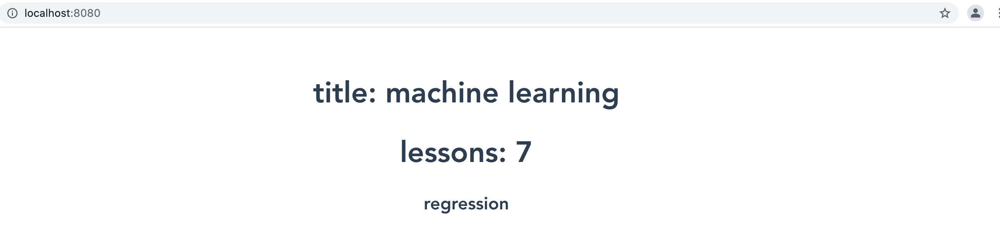
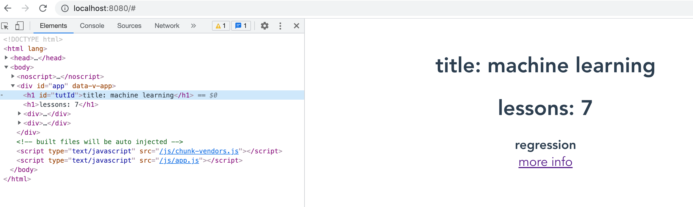

# Vue 深入浅出

> Vue 不仅在大企业中占有一席之地，而且也是中小企业的首选。而且现在前端岗位比较吃香，

## Vue 安装
### 准备工作
- 安装 nodejs
- 安装 visual studio code
- 安装 vetur 插件
### 安装 vue
有下面 3 种方式将 vue 添加到项目中
- **CDN** 方式引入 Vue，这种方式通常用于将 Vue 引入到你之前那些具有一定历史的项目
```html
<script src="https://unpkg.com/vue@next"></script>
```
- **npm** 方式安装 Vue，是使用Vue构建大规模应用程序的推荐方法。
```js
npm install vue@next
```
在用 Vue 构建大规模应用时，npm 这种方式相比与 CDN 方式安装 vue 更受欢迎的方法。
- **Vue CLI**(脚手架方式来安装 vue)

只需几分钟就能启动和运行，具有热重载、lint-on-save 和 production-ready 的构建功能。

```
npm install -g @vue/cli
```

**Vue** 提供了一个官方CLI，用于快速搭建单页应用程序的脚手架

- Vite
[vitejs](https://cn.vitejs.dev/) 是一种新型前端构建工具，能够显著提升前端开发体验。

```js
npm init vite@latest
```


### 使用 Vue/CLI 构建项目

查看 vue 版本

```vue
vue --version
```

```
@vue/cli 4.5.13
```

创建项目

```vue
vue create hello-world
```

提示选择构建项目是基于 vue2 还是 vue，这里选择`Default (Vue 3) ([Vue 3] babel, eslint)`选项来创建项目

```vue
Vue CLI v4.5.13
? Please pick a preset: (Use arrow keys)
❯ Default ([Vue 2] babel, eslint) 
  Default (Vue 3) ([Vue 3] babel, eslint) 
  Manually select features 
```

选择包管理工具，这里选择 `npm`

```vue
Vue CLI v4.5.13
? Please pick a preset: Default (Vue 3) ([Vue 3] babel, eslint)
? Pick the package manager to use when installing dependencies: (Use arrow keys)
❯ Use Yarn 
  Use NPM 
```

选择好包管理工具，就开始创建项目，当项目安装完成后运行如下命令

```
cd hello-world
npm run serve
```


```
 DONE  Compiled successfully in 1999ms                                              9:37:45 ├F10: AM┤


  App running at:
  - Local:   http://localhost:8080/ 
  - Network: http://192.168.50.32:8080/

  Note that the development build is not optimized.
  To create a production build, run npm run build.
```




## 项目结构



### pakcage.json 

在包管理文件 package.json 文件中列出了开发和发布时候依赖的包(库)。

```json
"dependencies": {
    "core-js": "^3.6.5",
    "vue": "^3.0.0"
  },
```


```json
"devDependencies": {
    "@vue/cli-plugin-babel": "~4.5.0",
    "@vue/cli-plugin-eslint": "~4.5.0",
    "@vue/cli-service": "~4.5.0",
    "@vue/compiler-sfc": "^3.0.0",
    "babel-eslint": "^10.1.0",
    "eslint": "^6.7.2",
    "eslint-plugin-vue": "^7.0.0"
  },
```


```json
"scripts": {
    "serve": "vue-cli-service serve",
    "build": "vue-cli-service build",
    "lint": "vue-cli-service lint"
  },
```


### package-lock.json

这个文件只有在 npm 在 5 以上版本才存在这个文件，也就是说在 npm 5 版本后才引进这个问个 package-lock.json，好处是让 npm 安装依赖时速度更快了。这是因为起初 npm 安装依赖时速度比较慢，所以 google facebook 就自己写了一个 yarn 工具来快速从 npm 仓库里拉取依赖。所以后来 npm 在 5 以后也引入 yarn 安装方式，当时 yarn 引入第三方依赖时就会引入 pakcage-lock.json。

这里既然说了就是把为什么有 pakcage-lock.json 这个文件就会下载比较快，当你用 `npm init -y` 初始化一个项目时候，这时并不会产生 `package-lock.json` 而是当你开始安装依赖时候就会产生 package-lock.json 文件，这个文件详细记录下载依赖的版本、下载地址以及hash 值等信息，所以在下一次安装时就可以通过读取这个文件快速定位到依赖的包，从而实现快速安装依赖包。


### babel.config.js

```js
module.exports = {
  presets: [
    '@vue/cli-plugin-babel/preset'
  ]
}
```


### 项目中的文件夹

| 项目         | 描述 |      |
| ------------ | ---- | ---- |
| Node_modules | 放置依赖库的文件 |      |
| public       | 其中放置一些静态资源，这里暂时包含两个文件 favicon.icon 和 index.html |      |
| src       |      |      |


### 项目源文件(src)

#### main.js

```js
import { createApp } from 'vue'
import App from './App.vue'

createApp(App).mount('#app')
```

这里将 Vue 的根组件 App 绑定到 id 为 app 的 div 的 DOM 元素上。

#### App.vue

```vue
<template>
  
  <HelloWorld msg="Welcome to Your Vue.js App"/>
</template>

<script>
import HelloWorld from './components/HelloWorld.vue'

export default {
  name: 'App',
  components: {
    HelloWorld
  }
}
</script>

<style>
#app {
  font-family: Avenir, Helvetica, Arial, sans-serif;
  -webkit-font-smoothing: antialiased;
  -moz-osx-font-smoothing: grayscale;
  text-align: center;
  color: #2c3e50;
  margin-top: 60px;
}
</style>
```

看这个文件主要有三部分组成，`template` 标签内为视图 `script` 间为脚步代码而 `style` 为样式代码。

#### components/HelloWorld.vue

```vue
<template>
  <div class="hello">
    <h1>{{ msg }}</h1>
    <p>
      For a guide and recipes on how to configure / customize this project,<br>
      check out the
      <a href="https://cli.vuejs.org" target="_blank" rel="noopener">vue-cli documentation</a>.
    </p>
    <h3>Installed CLI Plugins</h3>
    <ul>
      <li><a href="https://github.com/vuejs/vue-cli/tree/dev/packages/%40vue/cli-plugin-babel" target="_blank" rel="noopener">babel</a></li>
      <li><a href="https://github.com/vuejs/vue-cli/tree/dev/packages/%40vue/cli-plugin-eslint" target="_blank" rel="noopener">eslint</a></li>
    </ul>
    <h3>Essential Links</h3>
    <ul>
      <li><a href="https://vuejs.org" target="_blank" rel="noopener">Core Docs</a></li>
      <li><a href="https://forum.vuejs.org" target="_blank" rel="noopener">Forum</a></li>
      <li><a href="https://chat.vuejs.org" target="_blank" rel="noopener">Community Chat</a></li>
      <li><a href="https://twitter.com/vuejs" target="_blank" rel="noopener">Twitter</a></li>
      <li><a href="https://news.vuejs.org" target="_blank" rel="noopener">News</a></li>
    </ul>
    <h3>Ecosystem</h3>
    <ul>
      <li><a href="https://router.vuejs.org" target="_blank" rel="noopener">vue-router</a></li>
      <li><a href="https://vuex.vuejs.org" target="_blank" rel="noopener">vuex</a></li>
      <li><a href="https://github.com/vuejs/vue-devtools#vue-devtools" target="_blank" rel="noopener">vue-devtools</a></li>
      <li><a href="https://vue-loader.vuejs.org" target="_blank" rel="noopener">vue-loader</a></li>
      <li><a href="https://github.com/vuejs/awesome-vue" target="_blank" rel="noopener">awesome-vue</a></li>
    </ul>
  </div>
</template>

<script>
export default {
  name: 'HelloWorld',
  props: {
    msg: String
  }
}
</script>

<!-- Add "scoped" attribute to limit CSS to this component only -->
<style scoped>
h3 {
  margin: 40px 0 0;
}
ul {
  list-style-type: none;
  padding: 0;
}
li {
  display: inline-block;
  margin: 0 10px;
}
a {
  color: #42b983;
}
</style>

```


## 第一个组件

### .Vue 文件，

- vue 文件是一种自定义文件格式，使用类似 HTML 的语法来描述UI的一部分。
- 每个vue文件由三种类型的顶级语言块组成.

```
<template></template>
<script></script>
<style></style>
```

- 其中 template 代码块类似 HTML 来定义组件的 UI
- script 代码块中用于存放应用的逻辑和功能
- style 代码块中用于维护修饰 template 结构的样式

浏览器并不认识 vue 文件，在构建项目时，webpack 会用 vue 加载器对 vue 文件进行处理编译为浏览器可以识别的文件。


### 组件

其中 `HelloWorld.vue` 文件为一个单文件组件(SFC)，


## 绑定

### 绑定文本
今天介绍如何将 script 代码块中数据绑定到到 template 的 UI 上，我们把 hello-world 项目中 components 中 HelloWorld 组件去掉，让项目变得比较干净这样一来便于关注要学习内容。

```vue
<template>
<h1>Hello Vue</h1>
</template>

<script>
export default {
  name: 'App',
}
</script>

<style>
#app {
  font-family: Avenir, Helvetica, Arial, sans-serif;
  -webkit-font-smoothing: antialiased;
  -moz-osx-font-smoothing: grayscale;
  text-align: center;
  color: #2c3e50;
  margin-top: 60px;
}
</style>

```

在 Vue 数据绑定遵循 mustache 语法，大家可以了解一个 mustache 一些，对于一些小的项目或者比较鼓励项目可以引入 mustache 来实现数据绑定，早在之前自己就用用 mustache 实现过数据绑定。

```vue
<template>
<h1>{{title}}</h1>
</template>

<script>
export default {
  name: 'App',
  data(){
    return {
      title:"machine learning"
    }
  }
}
</script>

<style>
#app {
  font-family: Avenir, Helvetica, Arial, sans-serif;
  -webkit-font-smoothing: antialiased;
  -moz-osx-font-smoothing: grayscale;
  text-align: center;
  color: #2c3e50;
  margin-top: 60px;
}
</style>

```




在花括号也支持一些运算操作，

```vue
<template>
<h1>title: {{title}}</h1>
<h1>lessons: {{ 2 + 5 }}</h1>
</template>
```




### 指令集方式来绑定文本

在 Vue 提供另一种方式，用指令集方式来将文本绑定到页面上 DOM 元素，在 Vue 中指令集都是 v 加连接符方式的指令集。

```vue
<template>
<h1>title: {{title}}</h1>
<h1>lessons: {{ 2 + 5 }}</h1>
<h1 v-text="subTitle"></h1>
</template>
```





```vue
<template>
<h1>title: {{title}}</h1>
<h1>lessons: {{ 2 + 5 }}</h1>
<h1 v-text="subTitle">hello</h1>
</template>
```

```js
VueCompilerError: v-text will override element children.
at /Users/zidea2020/Desktop/myrepo/vue_tut/hello-world/src/App.vue:4:5
2  |  <h1>title: {{title}}</h1>
3  |  <h1>lessons: {{ 2 + 5 }}</h1>
4  |  <h1 v-text="subTitle">hello</h1>
   |      ^^^^^^^^^^^^^^^^^
5  |  </template>
6  |  
```


### 绑定 HTML


```vue

```

如果我们想要将 html 绑定到界面上，如果还有

```vue
<script>
export default {
  name: 'App',
  data(){
    return {
      title:"machine learning",
      subTitle:"<b>regression</b>"
    }
  }
}
</script>
```


```vue
<template>
<h1>title: {{title}}</h1>
<h1>lessons: {{ 2 + 5 }}</h1>
<div v-text="subTitle"></div>
</template>
```





```vue
<template>
<h1>title: {{title}}</h1>
<h1>lessons: {{ 2 + 5 }}</h1>
<div v-html="subTitle"></div>
</template>
```





```vue
<template>
<h1>title: {{title}}</h1>
<h1>lessons: {{ 2 + 5 }}</h1>
<div v-html="subTitle"></div>
<div v-html="moreInfo"></div>
</template>

<script>
export default {
  name: 'App',
  data(){
    return {
      title:"machine learning",
      subTitle:"<b>regression</b>",
      moreInfo: `<a href="#" onclick="alert('machine learning regression')" >more info</a>`
    }
  }
}
</script>
```


### 绑定属性

```vue
<template>
<h1 v-bind:id="tutId">title: {{title}}</h1>
<h1>lessons: {{ 2 + 5 }}</h1>
<div v-html="subTitle"></div>
<div v-html="moreInfo"></div>

</template>

<script>
export default {
  name: 'App',
  data(){
    return {
      tutId:'tutId',
      title:"machine learning",
      subTitle:"<b>regression</b>",
      moreInfo: `<a href="#" onclick="alert('machine learning regression')" >more info</a>`
    }
  }
}
</script>
```





####

```vue
<div v-bind:class="status">Log Level</div>
```


```vue
<style>
.success{
  color:greenyellow;
  font-weight: bolder;
}
.info {
  color: orangered;
  font-weight: bolder;
}
</style>
```


```vue
<template>
<h1 v-bind:id="tutId">title: {{title}}</h1>
<h1>lessons: {{ 2 + 5 }}</h1>
<div v-html="subTitle"></div>
<div v-html="moreInfo"></div>
<button v-bind:disabled="isDisable">btn</button>
<div v-bind:class="status">Log Level</div>
<h1 v-bind:class="isSuccess ? 'success':'danger'" >{{isSuccess ? 'success':'danger'}}</h1>
</template>

<script>
export default {
  name: 'App',
  data(){
    return {
      tutId:'tutId',
      title:"machine learning",
      subTitle:"<b>regression</b>",
      moreInfo: `<a href="#" onclick="alert('machine learning regression')" >more info</a>`,
      isDisable:false,
      status:"success",
      isSuccess:true
    }
  }
}
</script>
```

