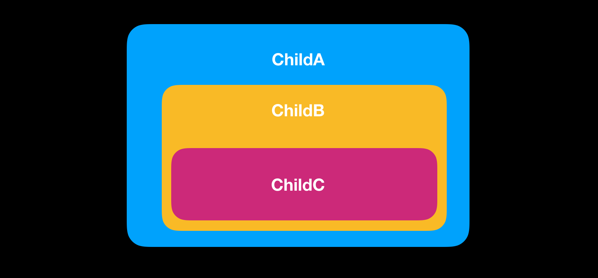

## Vue3 中的新特性—组合式 API(Composition API)

Vue 3的主要新增的功能是 Composition API(组合式 API)，每一个新事物的出现都是来解决问题，组合式 API 为我们提供了一种新的方式编写和组织组件。通过使用 Vue2 的 Options API 重构一个组件来学习如何使用。

### 什么是组合式 API(composition API)

- 组合式 API 是 Vue3 提供的新功能，为我们提供了另一种编写组件的方式

- Option API - data()、computed 属性、methods、watchers 和 lifecycle hooks 这些 Option API 是我们在 Vue2 时代构建组件的一种方式，不过在 Vue3 我们有了新的方式来编写和组织组件的方式，这种方式


简短的回答：代码共享。在 setup 钩子里面，可以按逻辑上的关注点来对代码进行分组，并与其他组件共享代码。

另一方面，在Options API中，我们有两种主要的方法在组件之间共享代码。Mixins 和 Renderless Components。多亏了 Composition API，我们再也不用使用Mixins了。Mixins 使得我们很难确定某些逻辑部分在使用它们的组件中是来自哪里。但我认为无渲染组件仍然是一个有价值的工具，即使在组件之间可以使用可组合的代码来共享。

### 组合式 API 的出现解决了什么样的问题

- 随着Vue项目规模和复杂性的增加，现有 Option API 变得难以应付
- 逻辑并没有真正地按功能分组，这可能会让人很难读懂一个庞大而复杂的组件文件。
- 通过 Option API 实现组件间共享重复的逻辑(共享代码)比较麻烦
- 通过组合时 API 我们可以将重用逻辑封装为功能，这个功能可以组件间共享，这样你就可以在整个应用程序的不同组件中使用这些逻辑。


简短的回答：代码共享。在设置钩子里面，我们可以按逻辑上的关注点来分组我们的代码部分。然后我们可以提取反应式逻辑的片段，并与其他组件共享代码。

另一方面，在Options API中，我们有两种主要的方法在组件之间共享代码。Mixins和Renderless Components。多亏了Composition API，我们再也不用使用Mixins了。混合器使得我们很难确定某些逻辑部分在使用它们的组件中是来自哪里。但我认为无渲染组件仍然是一个有价值的工具，即使在组件之间可以使用可组合的代码来共享。

### 组合式 API 

> 往往我们都对自己能力或者高估，或者低估，


我们先看一看 Vue2 的局限性，然后 Vue3 是解决这个问题，局限性如下

- 随着你的组件不断扩展，其可读性就会变得 hard，这也就意味着难于维护
- 组件间共享代码的模式不是那么优雅
- vue2 存在类型系统


#### 可读性

这里就拿搜索页面，这里先实现搜索功能，搜索功能分布在 data 还有 methods 中，随后可能还添加搜索过滤器和分页功能。逻辑上关注特点通过组件 option 来组织。也就是对于功能他们逻辑散落在 data、computed、 props、methods 和 lifecycle。其实我们希望将功能逻辑都集中在一起。

为什么叫 composition functions 组合函数，所谓组合式 Api 就是可以在 setup 组合这些函数来，其实主要有了 setup 我们就不会将功能拆分到各个 Option，


通过一个实例解释如何将 vue2 的中 Option-API 替换为组合式 API(composition API)。


- 组合式 API 替换 data(基本类型和复合类型)
- 组合式 API 替换 methods
- 组合式 API 替换 compute
- 组合式 API 替换 watcher
- 组合式 API 如何范围prop 属性
- 组合


#### 用于组合式 API 的响应式数据

在 Vue2 我们可以在 data 中定义一个基本类型数据或者一个复合类型数据，例如对象或者数组，然后将数据绑定到界面上，data 中定义数据可以被其他属性 computed 或者 methods 访问到，这些数据是**响应式数据**，

```vue
data(){
    return{
        title:"machine leanring"
    }
}
```

下面是组合式 API(composition API) 实现方式，在 setup 定义个变量后将其作为一个对象的属性返回，便可以通过 `{{title}}` 显示在界面上

```vue
setup(){
  const title = "machine learning"
  return {
  	title
  }
}
```

```vue
<h1 class="title">{{title}}</h1>
```

#### 响应式的基础类型数据

但是这样定义数据并不是响应式数据，不过 Vue3 提供两种方式在 `setup` 中定义响应式数据，分别是 `ref` 和 `reactive` 分别用于定义基本类型数据和复合数据。我们先看基础数据类型响应式方式为 `ref(基础数据)`，例如 String、Number 或者 Boolean 


```vue
        setup(){
            const title = ref("machine learning")
            return {
                title
            }
        }
```

#### 响应式的复合类型数据

对于对象可以用 `reactive`来定义响应式对象，然后再 `setup` 作为返回对象的一个属性将其返回供调用。

```vue
setup(){
  const title = ref("machine learning");
	let count = ref(0)
  const tut = reactive({
		title:'machine learning',
		lesson:12,
		chapters:[
          {id:0,title:"introducion"},
          {id:2,title:"regression"},
          {id:3,title:"classification"},
				]
      })
		return {
      title,
      count,
      tut
		}
}
```

在 Vue2 通过`defineProperty` API 提供 getter 和 setter 来监听数据来实现响应式数据，不过这个中实现方式存在一些问题就是如果有大量属性值作为

#### compute

看一看将 Option-API 的 compute，从 vue 引入 computed 函数接受一个函数，这个函数接受一些基础值的组合(操作)。

```vue
            const refTitlContent = computed(function(){
                return `${refTitle.value} ${refContent.value}`
            })
```


##### 完整代码

```vue
<template>
    <h1 class="title">{{refTitlContent}}</h1>
    <div class="card">
        <div class="card-header">
            <div class="card-header-title">{{title}}</div>
        </div>
        <div class="card-content">
            <div class="card-content-body">{{content}}</div>
        </div>
    </div>
    <div class="section">
        <div class="control">
            <input class="input" type="text" v-model="title"/>
        </div>
        <div class="control">
            <input class="input" type="text" v-model="content"/>
        </div>
    </div>
    <div class="section">
        <div class="control">
            <input class="input" type="text" v-model="refTitle"/>
        </div>
        <div class="control">
            <input class="input" type="text" v-model="refContent"/>
        </div>
    </div>
</template>

<script>
import { ref,computed } from 'vue'
    export default {
        name:"ReplaceComputed",
        setup(){
            const refTitle = ref('')
            const refContent = ref('')

            const refTitlContent = computed(function(){
                return `${refTitle.value} ${refContent.value}`
            })

            return {
                refTitle,
                refContent,
                refTitlContent
            }
        },
        data(){
            return {
                title:"",
                content:""
            }
        }
    }
</script>
```


#### watcher

watch 接受一个观察值，第一个参数接受可以是一个要观察变量或者由观察变量数组，第二个 handler 回调函数接受 newVal 和 oldVal 的函数。

```vue
        setup(){
            const refTitle = ref('');
            const refContent = ref('content');

            watch([refTitle,refContent],(newVals,oldVals)=>{
                console.log('Old refValue',oldVals[0]);
                console.log('New refValue',newVals[0]);
                console.log('New refValue',newVals[1]);
                console.log('New refValue',newVals[1]);
            })
            return {
                refTitle,
                refContent
            }
        },
```


也可以检测一个响应值，这里第一个参数是接受一个函数，这个函数返回的值是要监测的对象。

```vue
				const tut = reactive({
                tutTitle:'',
                tutContent:''
            });

            watch(()=>{return {...tut}}, function(newVal,oldVal){
                console.log('tut title',oldVal.tutTitle)
                console.log('tut title',newVal.tutTitle)
                // console.log('new tut title',newVal.tutContent)
                // console.log('new tut Content',newVal.tutContent)
            })
```


```vue
            watch(()=>tut.tutTitle,function(newVal,oldVal){
                console.log('old tut title',newVal);
                console.log('new tut title',oldVal);
            })
```

如果要想要深度检测对象就可以在第二参数中指定`deep:true`。

```vue
            const tut = reactive({
                tutTitle:'',
                tutContent:'',
                category:{
                    name:''
                }
            });
```


```vue
            const tut = reactive({
                tutTitle:'',
                tutContent:'',
                category:{
                    name:''
                }
            });

            watch(()=>tut.category,function(newVal,oldVal){
                console.log('new tut category',newVal)
                console.log('old tut category',oldVal)
            },{
                deep:true
            })
```


#### provide 和 inject

首先创建 3 个 Component 分别为 ChildA、ChildB 和 ChildC，依赖关系如下图



在 App.vue 文件中

- 引入 ChildA 组件
- 然后从 vue 引入 `provide` 函数，函数接受两个参数，第一个参数为提供变量名称，第二个参数为该变量的值

```vue
<template>
<div class="container">
  <ChildA/>
</div>

</template>

<script>
import ChildA from './components/Option/ChildA.vue'
import {provide} from 'vue';
export default {
  
  name: 'App',
  
  setup(){
    provide('refProvideTitle','machine learning 2');
  },
  
  data(){
    return {
      title:"machine learning",
    }
  },
  components:{
    ChildA
  },
  provide(){
    return{
      title:this.title
    }
  }
}
</script>
```

在 ChildC 文件中

- 从 vue 中引入 `inject` 
- 然后函数 `inject` 中，第一个参数接受变量名为 `refProvideTitle` 第二个参数为该参数的默认值
- `inject` 返回接受到 `injectedTitle` 一个响应式数据，然后将 `setup` 返回供模板使用

```vue
<template>
    <div>
        <h1 class="title">Child C</h1>
        <h1 class="title">{{title}}</h1>
        <h1 class="title"> injected Title:{{injectedTitle}}</h1>
    </div>
</template>

<script>
    import {inject} from 'vue';

    export default {

        name:"ChildC",
        setup(){
            const injectedTitle = inject('refProvideTitle','default machine leaerning2');
            return {
                injectedTitle
            }
        },
        inject:['title']
    }
</script>
```

上面我们完成如何通过组合式 API 在不同组件之间进行传值，

```vue
    const count = ref('0');
    const refTut = reactive({
      title:"machine learning title",
      content:"machine learning content"
    });

    provide('count',count);
    provide('tut',refTut);
```


```vue
<template>
<div class="container">
  <div class="control">
    <button class="button" @click="incrementCount" > increment </button>
  </div>
  <ChildA/>
</div>

</template>

<script>
import ChildA from './components/Option/ChildA.vue'
import {provide, ref, reactive} from 'vue';
export default {
  
  name: 'App',
  
  setup(){
    provide('refProvideTitle','machine learning 2');
    const count = ref('10');
    const refTut = reactive({
      refTitle: "machine learning title",
      refContent:"machine learning content"
    });

    function incrementCount(){
      count.value ++;
    }

    provide('count',count);
    provide('refTut',refTut);

    return {
      count,
      incrementCount,
    }
  },
  
  data(){
    return {
      title:"machine learning",
    }
  },
  components:{
    ChildA
  },
  provide(){
    return{
      title:this.title
    }
  }
}
</script>
```


##### 完整代码

```vue
<template>
<div class="container">
  <div class="control">
    <button class="button" @click="incrementCount" > increment </button>
  </div>
  <ChildA/>
</div>

</template>

<script>
import ChildA from './components/Option/ChildA.vue'
import {provide, ref, reactive} from 'vue';
export default {
  
  name: 'App',
  
  setup(){
    provide('refProvideTitle','machine learning 2');
    const count = ref('10');
    const refTut = reactive({
      refTitle: "machine learning title",
      refContent:"machine learning content"
    });

    function incrementCount(){
      count.value ++;
    }

    provide('count',count);
    provide('refTut',refTut);
    provide('incrementCount',incrementCount)

    return {
      count,
      incrementCount,
    }
  },
  
  data(){
    return {
      title:"machine learning",
    }
  },
  components:{
    ChildA
  },
  provide(){
    return{
      title:this.title
    }
  }
}
</script>


```


```vue
<template>
    <div>
        <h1 class="title">Child C</h1>
        <h1 class="title">{{title}}</h1>
        <h1 class="title"> injected Title:{{injectedTitle}}</h1>
        <h1 class="title"> injected count:{{childCount}}</h1>
        <h1 class="title"> injected refTitle:{{refTitle}}</h1>
        <h1 class="title"> injected refContent:{{refContent}}</h1>
        <div class="control">
            <button class="button" @click="incrementCount" > increment </button>
        </div>
    </div>
</template>

<script>
    import {inject, toRefs} from 'vue';

    export default {

        name:"ChildC",
        setup(){
            const injectedTitle = inject('refProvideTitle','default machine leaerning2');
            const childCount = inject('count',0);
            const childTut = inject('refTut',{});
            const incrementCount = inject('incrementCount')
            console.log(childTut)
            return {
                injectedTitle,
                childCount,
                ... toRefs(childTut),
                incrementCount
            }
        },
        inject:['title']
    }
</script>
```


### 生命周期对比

| Option API    | Hook inside(setup) |      |
| ------------- | ------------------ | ---- |
| beforeCreate  | 无需               |      |
| created       | 无需               |      |
| beforeMount   | onBeforemount      |      |
| mounted       | onMounted          |      |
| beforeUpdate  | onBeforeUpdate     |      |
| update        | onUpdated          |      |
| beforeUnmount | onBeforeUnmount    |      |
| errorCaptured | onErrorCaptured    |      |
| renderTracked | onRenderTracked    |      |
| renderTtriggered | onRenderTtriggered    |      |

#### template 引用

```vue
<template>
    <div class="section">
        <div class="control">
            <input type="text" class="input" ref="inputRef">
        </div>
    </div>
</template>

<script>
    export default {
        name:"ReplaceTemplateRef",
        mounted(){
            this.$refs.inputRef.focus()
        }
    }
</script>
```

这个大家都比较熟悉在 vue2 通过为 dom 元素指定一个 ref 便可以在 dom 元素绑定到 DOM tree 之后通过引用 `$refs.inputRef`来获取这个 DOM 元素的引用了。有点类似 jQuery 来操作 DOM 的方法。

接下来我们组合式 API 来实现一下，注意这里需要在 setup 函数经该 `inputRef` 返回


```vue
<script>
    import {ref, onMounted} from 'vue';

    export default {
        name:"ReplaceTemplateRef",
        setup(){
            const inputRef = ref(null);
            onMounted(()=>{
                console.log(inputRef.value)
                inputRef.value.focus();
            })
            return {
                inputRef
            }
        },
        // mounted(){
        //     this.$refs.inputRef.focus()
        // }
    }
</script>
```


#### prop

```vue
<template>
<div class="container">
  <Person/>
</div>

</template>

<script>
import Person from './components/Option/Person.vue';
     
export default {
  
  name: 'App',
  components:{
      Person
  }
}
</script>


```


```vue
<template>
    <div class="container">
        <div class="control">
            <input class="input" type="text" placeholder="tut title" v-model="tutTitle">
        </div>
        <div class="control">
            <input class="input" type="text" placeholder="tut content" v-model="tutContent">
        </div>
        <PersonGreeting :title="tutTitle" :content="tutContent" />
    </div>
</template>

<script>
    import {ref} from 'vue';
    import PersonGreeting from './PersonGreeting.vue'
    export default {
        name:"Person",
        components:{
            PersonGreeting
        },
        setup(){
            const tutTitle = ref('');
            const tutContent = ref('');
            return {
                tutTitle,
                tutContent,
            }
        }

    }
</script>

```


```vue
<template>
    <div class="section">
        <h1 class="title">{{title}}</h1>
        <h1 class="subtitle">{{content}}</h1>
    </div>
</template>

<script>
    export default {
        name:'PersonGreeting',
        props:['title','content']
        
    }
</script>
```


```vue
<template>
    <div class="section">
        <h1 class="title">{{title}}</h1>
        <h1 class="subtitle">{{content}}</h1>
        <h1 class="title"> description {{tutDescription}}</h1>
    </div>
</template>

<script>
import { computed } from 'vue'
    export default {
        name:'PersonGreeting',
        setup(props){
            const tutDescription = computed(()=>{
                return `${props.title} ${props.content}`
            })
            return {
                tutDescription 
            }
        },
        props:['title','content']
        
    }
</script>

<style scoped>

</style>
```


#### context

在 setup 接受两个参数第一个参数已经介绍过了 props，从这个参数 props 可以获取从父组件传入的参数，第二个参数 context 是对象有 attrs、emit 和 slots。可以通过 emit 从子组件向父组件传递数据。在父组件 Person 接受子组件发出事件 `sendDescription` 处理函数。

```vue
<template>
    <div class="container">
        <div class="control">
            <input class="input" type="text" placeholder="tut title" v-model="tutTitle">
        </div>
        <div class="control">
            <input class="input" type="text" placeholder="tut content" v-model="tutContent">
        </div>
        <PersonGreeting :title="tutTitle" :content="tutContent" @sendDescription="descriptionHandler" />

    </div>
</template>

<script>
    import {ref} from 'vue';
    import PersonGreeting from './PersonGreeting.vue'
    export default {
        name:"Person",
        components:{
            PersonGreeting
        },
        setup(){
            const tutTitle = ref('');
            const tutContent = ref('');
            function descriptionHandler(decription){
                alert(decription)
            }
            return {
                tutTitle,
                tutContent,
                descriptionHandler,
            }
        }

    }
</script>

```

通过 context 的 emit 方法发送事件，第一个参数是事件名，第二个参数是要通过事件传递的值。


```vue
<template>
    <div class="section">
        <h1 class="title">{{title}}</h1>
        <h1 class="subtitle">{{content}}</h1>
        <h1 class="title"> description {{tutDescription}}</h1>
        <button @click="sendEvent">send Description</button>
    </div>
</template>

<script>
import { computed } from 'vue'
    export default {
        name:'PersonGreeting',
        setup(props,context){
            const tutDescription = computed(()=>{
                return `${props.title} ${props.content}`
            })

            function sendEvent(){
                context.emit('sendDescription',tutDescription.value)
            }
            return {
                tutDescription,
                sendEvent
            }
        },
        props:['title','content']
        
    }
</script>
```


#### what's the composition API?

The composition API is a feature in Vue3 which gives us another way to write our components

More specifically, the script block in a component

Options API - data(), computed properties, methods, watchers & lifecycle hooks

What we've learned so far is the Options API which is one way to build components in Vue

The other way is to use the composition API


#### Why composition API?

- Vue projects became hard to manage as they grew in size and complexity
- With the options API, components are organized using options such as data, computed properties, methods, created, mounted and so on
- Logic isn't really grouped by feature, which can make it hard to read through a large and complex component file
- Re-using logic across components became difficult
- The composition API allows us to encapsulate one piece of functionality so that you can use it in different components throughout the application


For most users, Vue Options API was quite sufficient as it is. But since composition API became the new "cool" thing to do, libaries would exclusively support Composition API and not Options API


By looking at popularity of Vue2 it's evident that the vast majority of users are fine with its limitations


But I'm not really sure which problem(s) this solution solves. It only seems to add more complexity and makes the code less readable. Unless, maybe this demo looked more verbose because it was still in its early prototype phase - but if its still like the today, I think there needs to be simpler-to-use(and remember) alternative


We can create a standalone reactive state and/or properties...