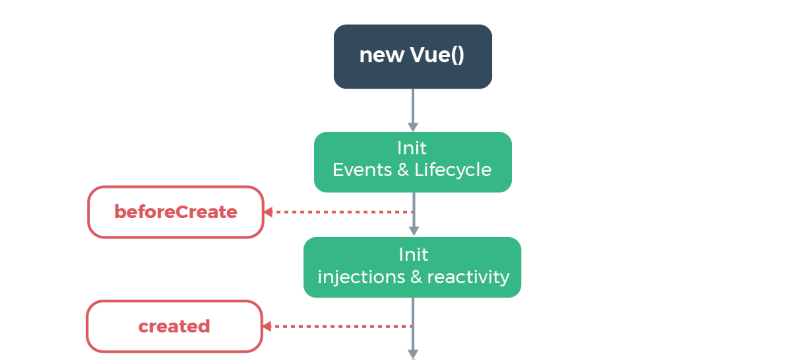

## Component Lifecycle Hooks

- 当 Vue 组件开始实例初始化就开始进入了 Vue 的生命周期
- 随着可监视数据的变换而回调不同声明周期函数
- 当一个组件实例销毁也就是意味着生命周期的结束


每个 Vue 实例在创建之后，要经过一系列的初始化过程，其中包括创建实例、加载模板、渲染模板等等。


> 注意，如果你使用的是组合式 API，setup 是在beforeCreate之后，在 create 之前调用的。


```vue
<template>
  <div id="app">
    <div>Hello Vue2.0</div>
  </div>
</template>
```


### beforeCreate 和 create



#### beforeCreate

你将有机会接触到实例本身! 但你将无法访问实例上的任何数据或事件。

```vue
data(){
    return {
      title:"machine learning",
      showChild:true
    }
  },
  components: {
    Child,
  },
  beforeCreate(){
      // 返回组件实例
      console.log("beforeCreate",this) //VueComponent
      console.log("beforeCreate",this.title) //beforeCreate undefined
      console.log("Parent beforeCreate()")
  },
```

当我们试图在 `beforeCreate` 中 `console.log(this.title)` 将会返回 `undefined`。 

#### created

你现在可以访问数据了，所以这是填充你的组件所需的任何初始数据的好时机。虽然现在数据还没有渲染到视图上，但是数据已经准备好了，可以通过网络获取数据，下面代码在 created 阶段获取数据，这样好处是在在渲染界面时数据已经准备好了，所以通常在渲染不会感知到等待时间。还有就是 created 钩子是除了 error captured  外唯一在服务器端渲染(SSR)时运行的钩子。

```vue
  created(){
      console.log("Parent create()")
      axios.get('https://jsonplaceholder.typicode.com/posts')
        .then((response) => {
            // console.log(response.data)
            this.posts = response.data
        })
        .catch((error)=>{
            console.log(error)
        });
  },
```


#### beforeMount

可能并不会经常用到这个回调函数，因为是在 DOM 渲染前运行该函数。但是如果想要你应用嵌入其他程序中，这是就需要应用程序外部数据，例如用到其他的库


#### mounted 

这是


A Vue component can go through 4 phases

- 创建(Creation): 在组件创建时执行
- 挂载(Mounting): 在组件加载时执行
- 更新(Updating): 当响应式数据被修改时执行
- 卸载(Unmounting)

Lifecycle hooks are methods that allow us to hook into or tap into these different phases in the lifecycle of a component and execute some code


this is best part to be populating your data you now have access to data although your view has not actually render yet but this is a great time to start making network calls to populate data in this example we can see that we have an application that takes in posts and that we're in our created hook we're going to call and get posts this is a good point to do this because you can get those network calls out sooner so the user has less of perceived wait time after the dom rerender

